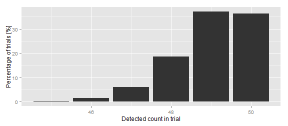

## The salesman pitch

Salesman: 
 > "Our metal detector will detect and reject pieces contaminated with metal with high accuracy. It will find 98% percent or more of the metal contaminated objects."

Customer:
 > "Sounds great but I'm doubtful. Lets do a trial where we run 50 contaminated pieces. If you are right it should miss at most 1 and we'll buy one."

Should the salesman accept these terms?

--- .class #id 

## The problem

Salesmen have the task of pitching a product to a customer, making him understand it and give him a good reason to believe why the pitch is true.

Customers want to be sure they get what they pay for and eliminate risk.

---

## Distribution of 50 piece trial outcomes w/ 98% detection probability

 

It is very likely that more than one piece will be missed! In this case the probability is

```r
probability.missing.more.than.one<-sum(dbinom(1:48,size=50,prob=0.98))
round(probability.missing.more.than.one,2)
```

```
## [1] 0.26
```

---
## The theory is complicated 

Lots of trials will actually fail to detect more than one piece even though the underlying probability is 98%.

Understanding this requires insight into probability, statistics, Bernoulli trials and hypothesis testing.

Those who require metal detectors are usually food producers, not statisticians.

Clearly there is an opportunity to help them understand the specifications and what they really mean.
* How many pieces should be used for verifying the specs?
* What detection probability is really needed?
* What should be the terms of the trial so the salesman has a good chance of getting a sale?

---
## The solution: Interactive simulation explorer for metal detector specifications

We have created an [interactive web page](https://hrafnkell.shinyapps.io/MetalDetectorSpecs) to train our sales people and help them understand the influence of detection probability on possible trial outcomes. 

They can even use [this web page](https://hrafnkell.shinyapps.io/MetalDetectorSpecs) to help the customer understand what quality assurance checks of his new metal detector really mean. Missing two detections might not indicate that the metal detector is not working correctly.
